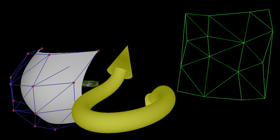
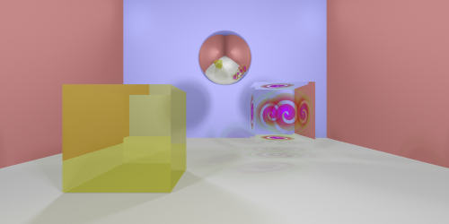

# ncollide
**ncollide** is a 2-dimensional and 3-dimensional collision detection library.
It is 100% written using Mozilla's [rust](rust-lang.org) programming language.
Collision detection and computational geometry in general are ubiquitous in
computer physics, graphics and animation. The involved algorithms are usually
non-trivial and require a great amount of time to get up and running.
To prevent others from spending significant amount of time re-writing collision
detection algorithms, **ncollide** is available open-source on
[github](http://github.com/sebcrozet/ncollide) and is released under the
permissive [BSD-3](http://opensource.org/licenses/BSD-3-Clause) licence. Feel
free to use (even commercially), modify, redistribute **ncollide**! To get
started contributing to the project, see the [How to
contribute](how_to_contribute/README.html) chapter.

**ncollide** does not have any dedicated chat room or forum yet. However, do
not hesitate to contact directly the authors by
[email](mailto:developer@crozet.re).

## How do we test ncollide?
**ncollide** does not have a lot of unit tests. But that does not mean it is
not tested at all! In the contrary, everything is thoroughly tested in
_real-life_ situations using three other rust projects:

1. [nphysics](http://nphysics-dev.org) − a 2d and 3d physics engine. It relies
   a lot on collision detection. It has at least one example using each
   collision detection algorithm provided by **ncollide**.

<iframe width="560" height="315" src="http://www.youtube.com/embed/CANjXZ5rocI" frameborder="0" allowfullscreen></iframe>

2. [kiss3d](http://kiss3d.org) − a 3d graphics engine. It relies on the
   procedural generation of geometries to render everything that is not
   triangular (sphere, cone, bezier surfaces, etc.). In particular it has a
   [demo](https://github.com/sebcrozet/kiss3d/blob/master/examples/procedural.rs)
   that uses most procedural generation algorithms of **ncollide**. In fact,
   every single 3d illustration of the [Procedural
   generation](procedural_generation/README.html) chapter has been rendered by
   **kiss3d**.

3. [nrays](https://github.com/sebcrozet/nrays) − a 3d and 4d ray tracer in
   rust. Obviously, it is used to test the ray-casting capabilities of
   **ncollide**. In fact, most 3d illustration of this guide have been rendered
   by **nrays**.

## About this book
This book intends to illustrate most feature of **ncollide**:
* [Collision detection](collision_detection/README.html) with optional [time of
  impact](collision_detection/time_of_impact.html) computation to perform
  _continuous collision detection_. [Space
  partitioning](collision_detection/broad_phase.html) techniques are used to
  allow geometric queries on scenes with thousands of objects.
* [Ray casting](ray_casting/README.html) against most geometries supported by
  the library.
* [Procedural generation](procedural_generation/README.html) of the geometries
  supported by the library. This is the process of transforming the implicit
  representation of **ncollide**'s geometries to triangle-meshes or line strips
  that can be efficiently rendered by the GPU.

[Getting started](getting_started/README.md) explains how to download and
compile **ncollide** from its source code. It also gives a compilable example
of code that uses the library.

Finally, the chapter [Traits](traits/README.md) gives an exhaustive list of the traits
exported by **ncollide**.

Note that this book is **not** an exhaustive documentation of the api of
**ncollide**. The complete documentation generated by rustdoc is available
online at:
* [ncollide2df32](doc/ncollide2df32), for 2d collision detection using single-precision numbers.
* [ncollide3df32](doc/ncollide3df32), for 3d collision detection using single-precision numbers.
* [ncollide4df32](doc/ncollide4df32), for 4d collision detection using single-precision numbers.
* [ncollide2df64](doc/ncollide2df64), for 2d collision detection using double-precision numbers.
* [ncollide3df64](doc/ncollide3df64), for 3d collision detection using double-precision numbers.
* [ncollide4df64](doc/ncollide4df64), for 4d collision detection using double-precision numbers.
