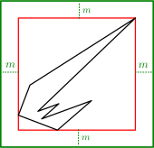

# Axis Aligned Bounding Box

As suggested by its name, the `bounding_volume::AABB` is a box with principal
axis aligned with the positive coordinate axis $$\bf x$$, $$\bf y$$, $$\bf z$$.

Its orientation being fixed at all times, it is completely defined by the
position of its extremal vertices (the two vertices with extremal values along
each coordinate axis):

| Method   | Description                                                    |
|--        | --                                                             |
| `mins()` | The AABB vertex with the smallest coordinates along each axis. |
| `maxs()` | The AABB vertex with the greatest coordinates along each axis. |

The AABB implements the `LooseBoundingVolume` trait so it can be enlarged by an
arbitrary thickness $$m$$:

Finally, note that an AABB supports ray casting as described by the
[RayCast](../ray_casting/README.html) trait.

## Creating an AABB
There are three ways to create an AABB. The main one is to use the usual
static method `AABB::new(mins, maxs)`. This will fail if one component of
`mins` is strictly greater than the corresponding component of `maxs`. The
second one is to use the unsafe constructor `AABB::new_invalid()`. It is unsafe
because the result AABB is invalid: its `mins` field is set to
[Bounded::max_value()](http://doc.rust-lang.org/std/num/trait.Bounded.html) and
its `maxs` field is set to
[-Bounded::max_value()](http://doc.rust-lang.org/std/num/trait.Bounded.html).
This is useful to initiate the merging of multiple AABB.

The last method to create an AABB is using the `boundoing_volume::HasAABB`
trait implemented by any `Geom`:

| Method    | Description                                     |
|--         | --                                              |
| `aabb(m)` | Computes the AABB of `self` transformed by `m`. |

This is the simplest way to compute the AABB of a geometry defined by
**ncollide**. Do not forget to explicitly `use` the trait in order to be
allowed call this method `use ncollide::bounding_volume::HasAABB`!

## Working example
The following example computes an AABB of two balls, merges them together and
performs some tests.

##### 3D
##### 2D
