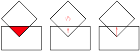

# Contact determination

Contact determination is the core feature of any collision detection library.
It is the process of determining if two objects are in contact. If they are,
the contact geometry is computed and stored into the `narrow::Contact`
structure:

| Field  | Description                                                              |
|--      | --                                                                       |
| `world1` | The contact point on the first object expressed in the absolute coordinate system. |
| `world2` | The contact point on the second object expressed in the absolute coordinate system. |
| `normal` | The contact normal expressed in the absolute coordinate system. I starts from the first object and points toward the second one. |
| `depth`  | The penetration depth of this contact. |

Here, _absolute coordinate system_ (sometimes called _world coordinate system_)
is the basis that is not relative to any object.

The last field requires some explanations. Sometimes, the objects in
contact are penetrating each other. Notably, if you are using **ncollide** for
physical simulation, this is an unrealistic configuration where the matter of
the two objects are superimposed. This penetration can be expressed in several
forms: the penetration volume, the minimal translational + rotational distance,
and the minimal translational distance:

**ncollide** implements the last one: the minimal translational distance, aka.
the _penetration depth_. This is the smallest translation along the contact
normal needed to remove any overlap between the two objects interiors.

## Persistant contact determination
The broad phase is the first step for detecting collisions on a complex dynamic
world. Every broad phase algorithms are aware of every objects present on the
world, and use spacial-partitioning like structures to find potential contact
pairs.
