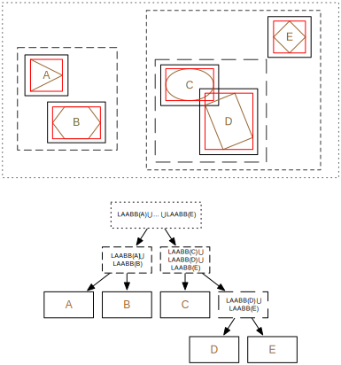

# Broad phase

A broad phase on **ncollide** may implement several traits. The first,
mandatory trait, is `broad::BroadPhase` that ensures that objects can be added,
removed and updated:

| Method                 | Description                                     |
|--                      | --                                              |
| `.add(geom)`           | Adds `geom` to this broad phase algorithm.      |
| `.remove(geom)`        | Removes `geom` from this broad phase algorithm. |
| `.update()`            | Updates this broad phase algorithm.             |
| `.update_object(geom)` | Notifies this broad phase algorithm that `geom` changed somehow (position, shape, etc.). |

Because the `BroadPhase` trait itself does not expose any collision-detection
related features, it is quite useless if implemented alone. If you are
interested in finding the set of objects intersecting a given bounding volume,
then use a broad phase that implements the `broad::BoundingVolumeBroadPhase`
trait:

| Method                | Description                                     |
|--                     | --                                              |
| `.interferences_with_bounding_volume(bv, result)` | Clones to `result` any object that intersects the bounding volume `bv` |

If you are interested in finding the set of objects intersecting a given ray,
then use a broad phase that implements the `broad::RayCastBroadPhase` trait:

| Method                | Description                                     |
|--                     | --                                              |
| `.interferences_with_ray(ray, result)` | Clones to `result` any object that intersects the bounding volume `bv` |

Of course, the objects you add to this kind of broad phase algorithm must
implement the [RayCast trait](../ray_casting/README.html).

Finally, if you need a broad phase algorithm that is able to find which pairs of
objects (among those that were added) might be in contact, use one that
implements the `broad::InterferencesBroadPhase` trait:

| Method                  | Description                                     |
|--                       | --                                              |
| `.for_each_pair(f)`     | Applies the closure `f` to each contact pair and its _associated data_. |
| `.for_each_pair_mut(f)` | Applies the closure `f` to each contact pair and a mutable reference to its _associated data_. 
| `.deactivate(geom)`     | Deactivates `geom`. Two deactivated objects cannot be in contact. |
| `.activate(geom, f)`    | Activates `geom` and applies the closure `f` on each new contact pairs involving the activated object. | 

Let us clarify what _associated data_ means here. A broad phase must associate
some data to each collision pair. Usually, this data is a collision detector
algorithm that will be used during the [Narrow
Phase](../contact_determination/narrow_phase.html). The method used by the
broad phase to generate this piece of data for each potential collision pair is
implementation-specific but most of the time it will use a factory that
implements the `broad::Dispatcher` trait:

| Method                   | Description                                     |
|--                        | --                                              |
| `.dispatch(geom1, geom2)` | Instantiates the data associated to the potential contact pair involving `geom1` and `geom2`. |
| `.is_valid(geom1, geom2)` | Tests if a collision pair between `geom1` and `geom2` is valid. |

Note that the life lengths of those _associated data_ is also
implementation-dependent. Therefore, if you write generic code that do not know
the exact type of the broad phase, you should not rely on the destruction time
(i.e. call to the `drop` method) of the data to perform useful tasks.

## The DBVT based Broad Phase

The `narrow::DBVTBroadPhase` is based on a Dynamic Bounding Volume Tree (DBVT)
to detect interferences. It implements all four broad phase-related traits
described above.

