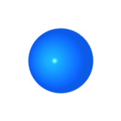
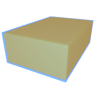
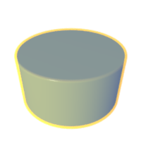
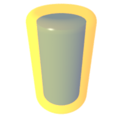
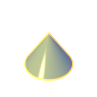
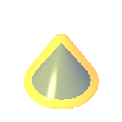
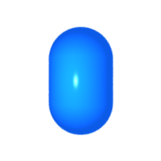
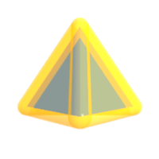

# Simple geometries

## Ball
Mathematically speaking, the `Ball` structure describes a closed ball on the
_n_-dimensional euclidean space. In two dimensions this is a disk, and in three
dimensions this is a sphere, centered at the origin.


| Description | Accessor | Value |
| --          | --       | --    |
| The radius of the ball | `b.radius()` | User-defined with `Ball::new` |

###### 2D and 3D example <div class="d3" onclick="window.open('../src/ball3d.rs')" /></div><div class="sp"></div><div class="d2" onclick="window.open('../src/ball2d.rs')"></div>

```rust
let ball = Ball::new(1.0);
assert!(ball.radius() == 1.0);
```

<center>
 
</center>


## Cuboid
The `Cuboid` structure describes a rectangle in two dimensions, or a cuboid in
three dimensions. A cuboid is defined by its _half extents_ − that is − its
half length along each coordinate axis.

| Description | Accessor | Value |
| --          | --       | --    |
| The half extents of the cuboid | `c.half_extents()` | User-defined with `Cuboid::new` |

###### 2D example <div class="d2" onclick="window.open('../src/cuboid2d.rs')"></div>

```rust
let cuboid = Cuboid::new(Vec2::new(2.0, 1.0));

assert!(cuboid.half_extents().x == 2.0);
assert!(cuboid.half_extents().y == 1.0);
```

###### 3D example <div class="d3" onclick="window.open('../src/cuboid3d.rs')"></div>

```rust
let cuboid = Cuboid::new(Vec3::new(2.0, 1.0, 3.0));

assert!(cuboid.half_extents().x == 2.0);
assert!(cuboid.half_extents().y == 1.0);
assert!(cuboid.half_extents().z == 3.0);
```

 

<center>

</center>


## Cylinder
The `Cylinder` structure describes a rectangle in two dimensions (use `Cuboid`
instead), or a cylinder in three dimensions. The principal axis is the positive
`y` axis.


| Description | Accessor | Value |
| --          | --       | --    |
| The half height of the cylinder | `c.half_height()` | User-defined with `Cylinder::new` |
| The radius of the cylinder basis | `c.radius()` | User-defined with `Cylinder::new` |

###### 3D example<div class="d3" onclick="window.open('../src/cylinder3d.rs')"></div>
```rust
let cylinder = Cylinder::new(0.5, 1.0);

assert!(cylinder.half_height() == 0.5);
assert!(cylinder.radius() == 1.0);
```

<table cellspacing="0" cellpadding="0" align="center" style="border:none;outline:none;">
<tr style="border:none;outline:none;">
<td style="border:none;outline:none;"></td>
<td style="border:none;outline:none;"></td>
</tr>
</table>


## Cone
The `Cone` structure describes an isosceles triangle in two dimensions, or a
cone of revolution in tree dimensions. A cone is defined by the _radius_ of its
basis and its _half height_ − the half distance between the basis and the apex.
The principal axis is the positive `y` axis.

| Description | Accessor | Value |
| --          | --       | --    |
| The half height of the cone | `c.half_height()` | User-defined with `Cone::new` |
| The radius of the cone basis | `c.radius()`     | User-defined with `Cone::new` |

###### 3D example<div class="d3" onclick="window.open('../src/cone3d.rs')"></div>

```rust
let cone = Cone::new(0.5, 0.75);

assert!(cone.half_height() == 0.5);
assert!(cone.radius() == 0.75);
```

<table cellspacing="0" cellpadding="0" align="center" style="border:none;outline:none;">
<tr style="border:none;outline:none;">
<td style="border:none;outline:none;"></td>
<td style="border:none;outline:none;"></td>
</tr>
</table>

## Capsule
The `Capsule` structure describes the Minkowski sum of a segment and a ball. In
other words, this is a cylinder with its flat extremities replaced by balls. A
capsule is defined by its _half height_ and the _radius_ of its extremities.
The principal axis is the positive `y` axis.

| Description | Accessor | Value |
| --          | --       | --    |
| The half height of the capsule | `c.half_height()` | User-defined with `Capsule::new` |
| The radius of the capsule extremities | `c.radius()` | User-defined with `Capsule::new` |

###### 2D and 3D example <div class="d3" onclick="window.open('../src/capsule3d.rs')"></div><div class="sp"></div><div class="d2" onclick="window.open('../src/capsule2d.rs')"></div>
```rust
let capsule = Capsule::new(0.5, 0.75);

assert!(capsule.half_height() == 0.5);
assert!(capsule.radius() == 0.75);
```

<center>

 
</center>

## Convex polytope

## Plane
The `Plane` structure describes a solid closed half-space. A plane is defined
by its _normal_. Every point that has a negative or zero dot product with the
plane normal is considered _inside_ of the plane. Other points are considered
_outside_ of the plane.

| Description | Accessor  | Value |
| --          | --        | --    |
| The normal of the plane | `p.normal()` | User-defined with `Plane::new` |

###### 2D example<div class="d2" onclick="window.open('../src/plane2d.rs')"></div>
```rust
let plane = Plane::new(Vec2::new(0.0, 1.0));

assert!(plane.normal().x == 0.0);
assert!(plane.normal().y == 1.0);
```

###### 3D example<div class="d3" onclick="window.open('../src/plane3d.rs')"></div>
```rust
let plane = Plane::new(Vec3::new(0.0, 1.0, 0.0));

assert!(plane.normal().x == 0.0);
assert!(plane.normal().y == 1.0);
assert!(plane.normal().z == 0.0);
```

## Mesh
The `Mesh` structure describes a polyline in two dimensions, or a triangle mesh
in three dimensions. A mesh is defined by a set of vertices, and a set of
indices. Each segment (resp. triangle) in 2d (resp. 3d) is identified by two
(resp. three) indices. It is also possible to provide one normal and one
texture coordinate per vertex. Those are not used for the collision detection
but are useful for ray-casting. Internally, collision detection is accelerated
using an AABB tree.

| Description | Accessor | Value |
| --          | --       | --    |
| The vertex buffer | `m.vertices()` | User-defined with `Mesh::new` |
| The index  buffer | `m.indiced()`  | User-defined with `Mesh::new` |
| The normals buffer | `m.normals()` | Optionally user-defined with `Mesh::new` |
| The texture coordinates buffer | `m.uvs()` | Optionally user-defined with `Mesh::new` |
| The bounding volume of each primitive (segment or triangle) | `m.bounding_volumes()` | Automatically computed |
| The space-partitioning acceleration structure used by the mesh | `m.bvt()` | Automatically computed |

###### 2D example<div class="d2" onclick="window.open('../src/mesh2d.rs')"></div>

```rust
let points = vec!(
    Vec2::new(0.0, 1.0),  Vec2::new(-1.0, -0.5),
    Vec2::new(0.0, -0.5), Vec2::new(1.0, -0.5)
    );

let indices = vec!(0u, 1,
                   1,  2,
                   2,  3,
                   3,  1);

// Build the mesh.
let mesh = Mesh::new(Arc::new(points), Arc::new(indices), None, None);

assert!(mesh.vertices().len() == 4);
```

<center>

</center>


###### 3D example<div class="d3" onclick="window.open('../src/mesh3d.rs')"></div>

```rust
let points = vec!(
    Vec3::new(0.0, 1.0, 0.0),   Vec3::new(-1.0, -0.5, 0.0),
    Vec3::new(0.0, -0.5, -1.0), Vec3::new(1.0, -0.5, 0.0)
    );

let indices = vec!(0u, 1, 2,
                   0,  2, 3,
                   0,  3, 1);

// Build the mesh.
let mesh = Mesh::new(Arc::new(points), Arc::new(indices), None, None);

assert!(mesh.vertices().len() == 4);
```

<center>

</center>

