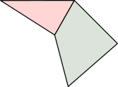

# Convex decomposition

As you might have noticed, a large variety of objects supported by **ncollide**
are convex. This is so because convex objects have nice properties that help
designing efficient algorithms.

Remember that an object is said to be convex if it is not self-crossing, and if
it contains any segment joining two of its points:

However, studies show that using only convex objects leads to very boring
applications! That is why **ncollide** allows the description of concave
objects from its convex parts using the
[Compound](../geometric_representations/composite_geometries.html#Compoind)
geometry. For example, one could describe the second object depicted above as
the union of two convex parts:

But decomposing manually a concave polyhedra in its convex parts is a very
tedious task and computing an exact convex decomposition is often not
necessary. That is why **ncollide** implements Khaled Mamou 3D
[HACD](http://kmamou.blogspot.fr/2011/10/hacd-hierarchical-approximate-convex.html)
algorithm that computes an **approximate** convex decomposition. It is not yet
implemented in 2D.

## HACD

The HACD is a simply a clustering algorithm based on a concavity criterion to
separate the different groups. It will group triangles together until the
directional distances between their vertices and their convex hull do not
exceeding an user-defined limit.

To compute the decomposition of a triangle mesh, use the `procedural::hacd`
function. It takes three arguments:

| Argument         | Description |
| --               | --          |
| `mesh`           | The `TriMesh` to decompose. It must have normals. Also, disconnected components of the mesh will not be merged together. |
| `error`          | The maximum _normalized concavity_ per cluster. It must **not** be a limit value like `Bounded::max_value()`. Values around 0.03 seems to give fine results for most objects. |
| `min_components` | Force the algorithm not to generate more than `min_components` convex parts. |

Let us define what _normalized concavity_ means. Because there is no official
definition of the concavity of a 3D object, we are using the maximal distance
between the triangle mesh vertex and its convex hull. This distance $$d$$ is
computed along the direction of the vertex normal:

Then, to make this concavity measure kind of independent from the whole shape
aspect-ratio, it is divided by the object AABB diagonal $$D$$:

We call the ratio $$\frac{d}{D}$$ the _normalized concavity_. In this example,
it is equal to $$\frac{6.0}{10.0} = 0.6$$.

The `procedural::hacd` function returns a tuple. The fist member of this
result is the set of convex objects that approximate the input mesh. The second
member is the set of indices of the triangles used to compute each convex
object.

PICTURE: original − convex objects − coloured triangles

## Example

The following example creates a concave object using
[path-based](../mesh_generation/paths.md) mesh generation and approximates it
using the HACD algorithm. Together with
[kiss3d](http://github.com/sebcrozet/kiss3d), this code was used to generate
the last three images.
