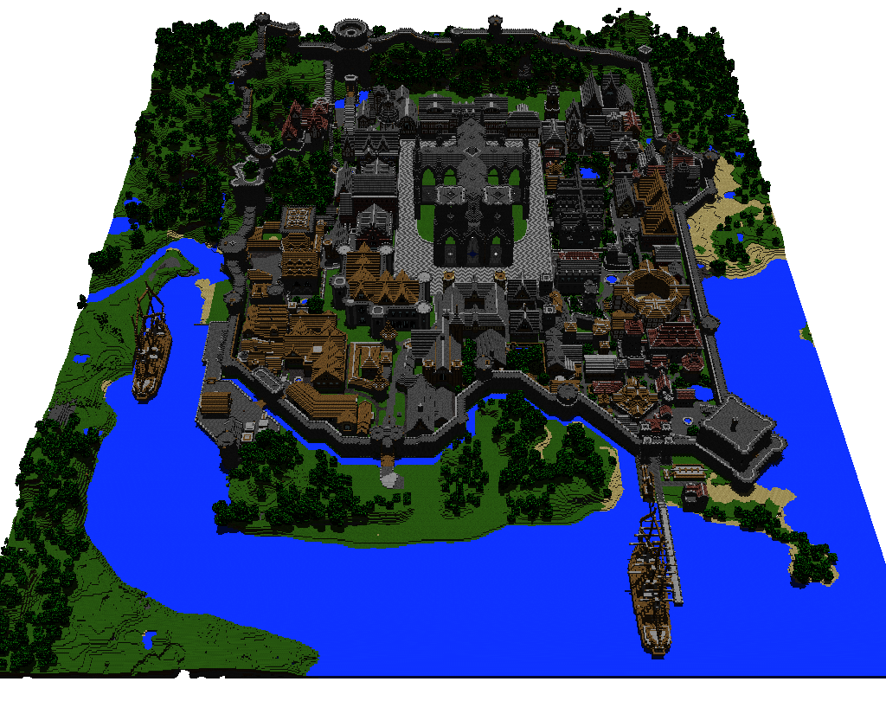
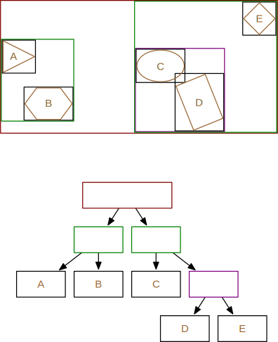

## Acceleration structures

Without an efficient spacial partitioning structure, we would not be able to
ray-trace a complex scene with millions of triangles like this one (6,704,264
triangles):

If your objects can move, you should use a [broad
phase](../contact_determination/broad_phase.html) that implements the
`broad::RayCastBroadPhase` trait. A lighter, often simpler, alternative is to
use the `spacial_partitionning::DBVT` structure directly (it is used by one
of the broad phase algorithms).

## The BVT
If your scene is static, better performances will be achieved by a static
spacial partitioning structure. At the moment, the only one implemented by
**ncollide** is the Bounding Volume Tree `spacial_partitionning::BVT`. For
example, the following figure depicts a set of 2D objects (brown), their AABB
(black) and the correspondig AABB Tree (one color per depth):

Note that, even if this example uses AABB, the `BVT` is generic with regard to
the type of bounding volume (e.g. we could use bounding spheres instead).

#### Creating a BVT

Note that the `geom::Mesh` geometry uses a BVT filled with AABB intenally.
Therefore, if your scene is composed of triangles only, grouping them all into
a `Mesh` with a custom margin of zero (using `Mesh::new_with_margin`) should
be enough to get good performances.

#### Using a BVT

## Complete working example

Here is an example that sets up a scene using a `BVT`, and casts some rays on
it.

##### 3D

##### 2D
