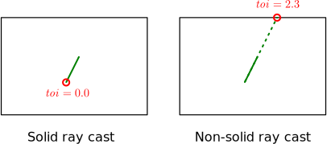

# Solid Ray Cast

If the starting point of a ray is inside of a shape, the result depends on the
value of the `solid` flag. A solid ray cast (`solid` is set to `true`) will
return an intersection with its `toi` field set to zero and its `normal`
undefined. A non-solid (`solid` is set to `false`) ray cast will assume the
shape is hollow, and will propagate inside of the shape until it encounters its
contour:

If the starting point of the ray is outside of any geometry, then the `solid`
flag has no effect. Also note that a solid ray cast is usually **faster** than
the non-solid one.

## Example
