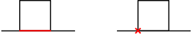

# Collision detection pipeline

While detecting contacts between only two objects might be useful, we are often
interested to work with complex scenes involving thousands of objects that may
move. Iterating through each pair of object and testing each of them for
intersection is a $O(n^2)$ process which is not practicable in real-time.


To avoid this, the collision detection pipeline is usually decomposed into two
steps: the [broad phase](../contact_determination/broad_phase.html) and the
[narrow phase](../contact_determination/narrow_phase.html). The first one is
aware of the position of every object (i.e. not only two) so it can use
spacial partitioning with conservative interference detection algorithms to
find all the potential collision pairs. The second phase iterates on all those
pairs and performs the exact contact determination. Note that the two objects
paired by the broad phase may not actually be in contact (_false positives_).
On the other hand, a broad phase is guaranteed not to produce _false
negatives_: two interfering objects are guaranteed to be paired.


# Broad phase

A broad phase on **ncollide** must implement the `broad_phase::BroadPhase`
trait that ensures that objects can be added, removed, updated, and supports
common geometric queries:

| Method                 | Description                                     |
|--                      | --                                              |
| `.defered_add(uid, bv, data)`                     | Informs the broad phase algorithm that a new object with the identifier `uid`, the bounding volume `bv`, and the associated data `data` has to be added during the next update. |
| `.defered_remove(object)`                         | Informs the broad phase algorithm that the object identified by `uid` must be removed at the next update. |
| `.defered_set_bounding_volume(uid, bv)`           | Informs the broad phase algorithm that the object identified by `uid`’s bounding volume has to be replaced by `bv` at the next update. |
| `.update(filter, callback)`                       | Updates this broad phase algorithm, actually performing object addition and removal. `filter` is a predicate that indicates if a new potential collision pair is valid. If it is (`filter` returns `true`), `callback` will be called for each such now collision pair. `callback` is also called |
| `.interferences_with_bounding_volume(bv, result)` | Fills `result` with references to each object which bounding volume intersects the bounding volume `bv`. |
| `.interferences_with_ray(ray, result)`            | Fills `result` with references to each object which bounding volume intersects the ray `ray`. |
| `.interferences_with_point(point, result)`        | Fills `result` with references to each object which bounding volume contains the point `point`. |

Let us clarify what _associated data_ means here. A broad phase is guaranteed
to associate some pieces of data to each object. Those data are completely
user-defined (e.g. they can even be as general as `Box<Any>`) and are passed as
argument to the user-defined callbacks when the `update` method is called.
Therefore, feel free to store in there any piece of data that may be useful to
identify the object on your side and to filter out unwanted collision pairs.

### The DBVT broad phase

The `broad_phase::DBVTBroadPhase` is based on a Dynamic Bounding Volume Tree (DBVT)
to detect interferences. It implements all four broad phase-related traits
described above.


The `partitioning::DBVT` structure itself is a proper binary tree that maps a
bounding volume to the object it bounds on its leaves. The internal nodes only
contain a bounding volume that bounds all its children. The following figure
shows an example of tree that bounds a set of brown objects with their red
AABB. Note that, instead of the exact bounding volumes (read), the
`DBVTBroadPhase` stores their loosened version (black):

<center>

</center>

Creating a `DBVTBroadPhase` is simple using the idiomatically named
`::new(margin, small_keys)` function:
```rust
let mut dbvt = DBVTBroadPhase::new(0.08, false);
```
Storing the loosened bounding volumes instead of the exact ones is a
significant optimization for scenes where the broad phase has to track contact
pairs involving slow-moving objects: the DBVT is updated only when the
displacement of an object is large enough to make its exact bounding volume
move out of the loosened version stored on the tree. That way objects moving at
high frequency but low amplitude will almost never trigger an update, at the
cost of a less tight bounding volume for interference detection (i.e. more
false positives). The amount of loosening is controlled by the first argument
`margin`. The second argument `small_keys` is here for optimization
purpose. Set it to `true` if and only if you know that the integer keys you use
to identify your objects are small enough (as in "small enough for them to be
used as keys on a `Vec` instead of a `HashMap`"). If you are not sure of the
values your keys may take, set `small_keys` to `false`.


## Example
The following example creates four balls, adds them to a `DBVTBroadPhase`,
updates the broad phase, and removes some of them.

#### 2D example <div class="d2" onclick="window.open('https://raw.githubusercontent.com/sebcrozet/ncollide/master/examples/dbvt_broad_phase2d.rs')" ></div>
```rust
/*
 * Create the objects.
 */
let poss = [ Isometry2::new(Vector2::new(0.0, 0.0), na::zero()),
             Isometry2::new(Vector2::new(0.0, 0.5), na::zero()),
             Isometry2::new(Vector2::new(0.5, 0.0), na::zero()),
             Isometry2::new(Vector2::new(0.5, 0.5), na::zero()) ];

// We will use the same geometry for the four objects.
let ball = Ball::new(0.5);

/*
 * Create the broad phase.
 * We know we will use small uids (from 0 to 3)so we can pass `true` as the second argument.
 */
let mut bf = DBVTBroadPhase::new(0.2, true);

// First parameter:  a unique id for each object.
// Second parameter: the object bounding box.
// Third parameter:  some data (here, the id that identify each object).
bf.defered_add(0, bounding_volume::aabb(&ball, &poss[0]), 0);
bf.defered_add(1, bounding_volume::aabb(&ball, &poss[1]), 1);
bf.defered_add(2, bounding_volume::aabb(&ball, &poss[2]), 2);
bf.defered_add(3, bounding_volume::aabb(&ball, &poss[3]), 3);

// Update the broad phase.
// The collision filter (first closure) prevents self-collision.
bf.update(&mut |a, b| *a != *b, &mut |_, _, _| { });

assert!(bf.num_interferences() == 6);

// Remove two objects.
bf.defered_remove(0);
bf.defered_remove(1);

// Update the broad phase.
// The collision filter (first closure) prevents self-collision.
bf.update(&mut |a ,b| *a != *b, &mut |_, _, _| { });

assert!(bf.num_interferences() == 1)
```

#### 3D example <div class="d3" onclick="window.open('https://raw.githubusercontent.com/sebcrozet/ncollide/master/examples/dbvt_broad_phase3d.rs')" ></div>
```rust
/*
 * Create the objects.
 */
let poss = [ Isometry3::new(Vector3::new(0.0, 0.0, 0.0), na::zero()),
             Isometry3::new(Vector3::new(0.0, 0.5, 0.0), na::zero()),
             Isometry3::new(Vector3::new(0.5, 0.0, 0.0), na::zero()),
             Isometry3::new(Vector3::new(0.5, 0.5, 0.0), na::zero()) ];

// We will use the same geometry for the four objects.
let ball = Ball::new(0.5);

/*
 * Create the broad phase.
 * We know we will use small uids (from 0 to 3)so we can pass `true` as the second argument.
 */
let mut bf = DBVTBroadPhase::new(0.2, true);

// First parameter:  a unique id for each object.
// Second parameter: the object bounding box.
// Third parameter:  some data (here, the id that identify each object).
bf.defered_add(0, bounding_volume::aabb(&ball, &poss[0]), 0);
bf.defered_add(1, bounding_volume::aabb(&ball, &poss[1]), 1);
bf.defered_add(2, bounding_volume::aabb(&ball, &poss[2]), 2);
bf.defered_add(3, bounding_volume::aabb(&ball, &poss[3]), 3);

// Update the broad phase.
// The collision filter (first closure) prevents self-collision.
bf.update(&mut |a, b| *a != *b, &mut |_, _, _| { });

assert!(bf.num_interferences() == 6);

// Remove two objects.
bf.defered_remove(0);
bf.defered_remove(1);

// Update the broad phase.
// The collision filter (first closure) prevents self-collision.
bf.update(&mut |a ,b| *a != *b, &mut |_, _, _| { });

assert!(bf.num_interferences() == 1)
```


# Narrow phase

A collision detector meant to be used during the broad phase must implement one
of two traits. First, the `narrow::CollisionDetector` trait is for contact
determination algorithms between two shapes with a type known at compile-time:

| Method | Description |
|--      | --          |
| `.update(...)`  | Given the two shapes and their position, determines their contact geometry without returning it. |
| `.num_colls() ` | The number of contacts detected by the last `.update(...)`.  |
| `.colls(out)`   | Collects to `out` the contacts detected by the last `.update(...)`. |

A typical use of this kind of detector is to first `.update(...)` it and then collect its
result with a vector using `.colls(...)`.


However, a collision detector that works with a composite shape like e.g.
the `Compound` has to be able to perform himself some sort of mini-broad phase
to find collision pairs between its individual parts. Those individual parts
having an exact type unknown at compile-time, it is necessary to perform some
sort of redispatch to find the correct contact determination sub-algorithm.
This is allowed by the `narrow::GeomGeomCollisionDetector` trait:

| Method | Description |
|--      | --          |
| `.update(dispatch, ...)`  | Given the two shapes and their position, determines their contact geometry without returning it. If a collision algorithm redispatch is necessary, use the first argument `dispatch`. |
| `.num_colls() ` | The number of contacts detected by the last `.update(...)`.  |
| `.colls(out)`   | Collects to `out` the contacts detected by the last `.update(...)` |

It is the same as the previous trait, except that the `.update(...)` method
takes two trait-objects as geometries and an instance of the
`narrow::GeomGeomDispatcher` that is able to find the correct collision
detection algorithm for those trait-objects.

Note that if you are not interested by the whole collision detection pipeline
but only by the exact contact determination algorithms, the
`narrow::GeomGeomDispatcher` can be used alone to retrieve the correct
collision detection algorithm, depending on your geometries:

```rust
let dispatcher = GeomGeomDispatcher::new(0.10);
let shape1 = Ball::new(0.5);
let shape2 = Cylinder::new(0.5, 1.0);
let shape3 = Cone::new(0.5, 1.0);

let ball_vs_cylinder_detector = dispatcher.dispatch(&shape1, &shape2);
let ball_vs_cone_detector     = dispatcher.dispatch(&shape1, &shape3);
let cylinder_vs_cone_detector = dispatcher.dispatch(&shape2, &shape3);
```

The following table shows which structure to use for which kind of object
pair:

|                     | Ball | SupportMap shape | Mesh | Compound | Plane |
| --                  | :--: | :--: | :--: | :--: | :--: |
| **Ball**            | `BallBall` | `SupportMapSupportMap` | `ShapeConcaveShape` | `ShapeConcaveShape` | `SupportMapPlane`    |
| **`SupportMap` shape** | `SupportMapSupportMap` | `SupportMapSupportMap` | `ShapeConcaveShape` | `ShapeConcaveShape` | `SupportMapPlane` |
| **Mesh**            | `ConcaveShapeShape` | `ConcaveShapeShape` | $\emptyset$ | `ConcaveShapeShape` | `ConcaveShapeShape` |
| **Compound**        | `ConcaveShapeShape` | `ConcaveShapeShape` | `ConcaveShapeShape` | `ConcaveShapeShape` | `ConcaveShapeShape` |
| **Plane**           | `PlaneSupportMap` | `PlaneSupportMap` | `ShapeConcaveShape` | `ShapeConcaveShape` | $\emptyset$ |

where **SupportMap shape** designs the `Capsule`, `Cone`, `Convex`, and `Cuboid`.
See the
[documentation](../doc/ncollide3df32/narrow/struct.GeomGeomDispatcher.html) of
the `GeomGeomDispatcher` for details about how to replace a contact
determination algorithm by your own.


Note that the `::new(...)` constructors of all those collision detectors take
an argument called the _prediction margin_. This will make them generate
contacts if the two objects are closer than this margin but not necessarily
touching. In this case the `depth` field of the resulting `Contact` is
negative and corresponds to the minimal distance separating them.  This is
useful to estimate how and when two objects that are _close enough_ may
eventually touch or penetrate if they are moved.

## Conforming contacts
All the algorithms presented above are limited to punctual contacts. Therefore
if you have a cube lying on a plane only one contact will be returned (right)
instead of a theoretically infinite set of point (left):

<center>

</center>


Those planar contacts that cannot be assimilated to a single point are called
_conforming contacts_. Approximating the shape of such contact with more than
one point is critical for some application like e.g. physics simulation with
contact laws based exclusively on a discrete number of isolated contact points.
The following figure shows what would happen on this kind of physics simulation
with a conforming contact approximated by only one point:

<center>

</center>

Here, the cube is falling toward the plane. When a contact is detected, the
cube is penetrating the plane and the physics engine will try to correct this
situation by applying a force to the contact point. This forces the object to
(unrealistically) rotate, moving the contact point to the over side.  This
alternation between two contact points due to unwanted rotations makes the
simulation instable and unrealistic. That is why **ncollide** provides contact
determination algorithms wrappers that can generate a full contact manifold
either incrementally or in a single shot.

### Incremental contact manifold generation
The `narrow::IncrementalContactManifoldGenerator` stores the results of the
wrapped collision detector, and updates them as the objects involved in the
contact move. After a few updates, a full manifold will be created:

<center>

</center>

Obviously, storing the contact points at each update indefinitely is costly
and not necessary. This is why if more than 2 (resp. 4) contacts in 2D (resp.
3D) are stored, the surplus will be removed. This removal is smart enough to
maximize the area spanned by the remaining contact points. For example, the red
contact has been removed from the last part of the previous figure because it
is less significant than the two others.

The `IncrementalContactManifoldGenerator` can be used to wrap any structure
that implements the `CollisionDetector` trait and that generates a single
contact point:
```rust
let plane_vs_cuboid: PlaneSupportMap<Cuboid> = PlaneSupportMap::new(0.04);

let full_manifold_plane_vs_cuboid = IncrementalContactManifoldGenerator::new(0.04, plane_vs_cuboid);
```

### One-shot contact manifold generation
The `narrow::OneShotContactManifoldGenerator` is slower but more accurate than
the `IncrementalContactManifoldGenerator` as it is able to generate a full
manifold as soon as only one contact has been detected. This is done by
applying small artificial rotations to one of the object in contact, and
accumulating the new points generated by the wrapped collision detector.
Therefore, from the user point of view, a full manifold has been generated at
once:
<center>

</center>

To reduce the computation times of this wrapper, the
`OneShotContactManifoldGenerator` stops this rotation-based algorithm and acts
like the incremental one as long as the manifold has been generated once.

The `OneShotContactManifoldGenerator` can be used to wrap any structure
that implements the `CollisionDetector` trait and that generates a single
contact point:
```rust
let plane_vs_cuboid: PlaneSupportMap<Cuboid> = PlaneSupportMap::new(0.04);

let full_manifold_plane_vs_cuboid = OneShotContactManifoldGenerator::new(0.04, plane_vs_cuboid);
```

# Collision world 
The `CollisionWorld` groups geometrical shapes, their positions, the broad
phase, and the narrow phase, into a single structure with a user-friendly
interface.

## Collision objects
### Collision groups
### Collision query type
## Event notifications

## Example
