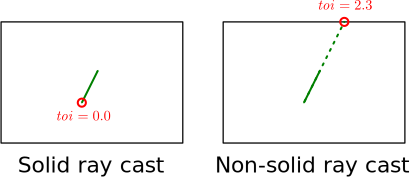
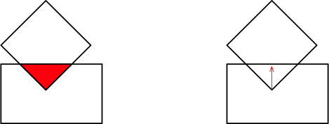

## Single-shape queries
Geometric queries involving only one shape are exposed through traits. Most of
them declare several methods that achieve similar goals but with different
levels of details: from simple boolean tests to complete geometric descriptions
of the results. Of course, a general rule is to assume that the less detailed
queries are be the fastest to execute.

### Point projection
It is possible to check whether or not a point is inside of a shape, to project
it, or to compute the distance from a point to a shape. Those queries are
exposed by the `PointQuery` trait:

| Method | Description |
|--      | --          |
| `.project_point(m, pt, solid)`                   | Projects the point `pt` on `self` transformed by `m`. |
| `.distance_to_point(m, pt, solid)`               | Computes the distance between the point `pt` and `self` transformed by `m`. |
| `.contains_point(m, pt)` | Tests whether the point `pt` is inside of `self` transformed by `m`. |

The `solid` flag indicates whether the projection is solid or not. If `solid`
is set to `false` then, the point will be projected on the shape border even if
it is located on its inside. If `solid` is set to `true` then a copy of point
to be projected is returned if it is inside of the shape. Note that a solid
point projection (or distance computation) is usually much more efficient than
a non-solid one.

<center>

</center>

The result of point projection is given by the `PointProjection`
structure:

| Field    | Description                               |
|--        | --                                        |
| `is_inside` | Set to `true` if the point is inside of the shape. |
| `point`     | The projection.  |

The result of the distance computation with `.distance_to_point(...)` is a
signed real number. If the projection is non-solid and the returned distance
negative, then the point is located inside of the shape and this number's
absolute value gives the shortest distance between the point and the shape
border. It is zero if the projection is solid and the point located inside of
the shape.


The following examples attempt to project two points `point_inside` and
`point_outside` on a cuboid. Because `point_inside` is located inside of the
cuboid, the resulting distance will be zero if the projection is solid, or
negative otherwise. The distance from `point_outside` to the cuboid is not
affected by the `solid` flag because it is outside of it anyway.

<ul class="nav nav-tabs">
  <li class="active"><a id="tab_nav_link" data-toggle="tab" href="#solid_point_query_2D">2D example</a></li>
  <li><a id="tab_nav_link" data-toggle="tab" href="#solid_point_query_3D">3D example</a></li>
  <div class="d3" onclick="window.open('https://raw.githubusercontent.com/sebcrozet/ncollide/master/examples/solid_point_query3d.rs')"></div>
  <div class="sp"></div>
  <div class="d2" onclick="window.open('https://raw.githubusercontent.com/sebcrozet/ncollide/master/examples/solid_point_query2d.rs')"></div>
</ul>

<div class="tab-content" markdown="1">
  <div id="solid_point_query_2D" class="tab-pane in active">
```rust
let cuboid     = Cuboid::new(Vector2::new(1.0, 2.0));
let pt_inside  = na::origin::<Point2<f32>>();
let pt_outside = Point2::new(2.0, 2.0);

// Solid projection.
assert_eq!(cuboid.distance_to_point(&Identity::new(), &pt_inside, true), 0.0);

// Non-solid projection.
assert_eq!(cuboid.distance_to_point(&Identity::new(), &pt_inside, false), -1.0);

// The other point is outside of the cuboid so the `solid` flag has no effect.
assert_eq!(cuboid.distance_to_point(&Identity::new(), &pt_outside, false), 1.0);
assert_eq!(cuboid.distance_to_point(&Identity::new(), &pt_outside, true), 1.0);
```
  </div>
  <div id="solid_point_query_3D" class="tab-pane">
```rust
let cuboid     = Cuboid::new(Vector3::new(1.0, 2.0, 2.0));
let pt_inside  = na::origin::<Point3<f32>>();
let pt_outside = Point3::new(2.0, 2.0, 2.0);

// Solid projection.
assert_eq!(cuboid.distance_to_point(&Identity::new(), &pt_inside, true), 0.0);

// Non-solid projection.
assert_eq!(cuboid.distance_to_point(&Identity::new(), &pt_inside, false), -1.0);

// The other point is outside of the cuboid so the `solid` flag has no effect.
assert_eq!(cuboid.distance_to_point(&Identity::new(), &pt_outside, false), 1.0);
assert_eq!(cuboid.distance_to_point(&Identity::new(), &pt_outside, true), 1.0);
```
  </div>
</div>

### Ray casting

Ray casting is also one of the core geometric queries in the field of collision
detection. Besides the fact it can be used for rendering (like ray-tracing), it
is useful for, e.g., continuous collision detection and navigation on a virtual
environment. Therefore **ncollide** has efficient ray casting algorithms for
all the shapes it implements (including functions that are able to cast rays on
arbitrary
[support-mapped](../geometric_representations/index.html#support-mappings)
convex shapes). The main ray-casting related data structure is the `Ray`
itself:

| Field  | Description                    |
|--      | --                             |
| `orig` | The ray starting point.        |
| `dir`  | The ray propagation direction. |


The result of a successful ray-cast is given by the `RayIntersection`
structure:

| Field    | Description                               |
|--        | --                                        |
| `toi`    | The _time of impact_ of the ray on the object. |
| `normal` | The normal (in absolute coordinates) at the intersection point of the shape hit by the ray.  |
| `uvs`    | If available, the texture coordinates at the intersection point of the shape hit by the ray. If the texture coordinates information is not computable, this is set to `None`. |

Recall that the exact point of intersection may be computed from the
 _time of impact_:

```rust
let intersection_point = ray.orig + ray.dir * result.toi
```
Because `ray.dir` does not need to be normalized, a physical interpretation of
the time of impact is the time needed for a point with velocity `ray.dir` to
travel from the position `ray.orig` to the object.


The `RayCast` trait is implemented by shapes that can be intersected by a ray:

| Method | Description |
|--      | --          |
| `.toi_with_ray(m, ray, solid)`                   | Computes the time of impact of the intersection between `ray` and `self` transformed by `m`. |
| `.toi_and_normal_with_ray(m, ray, solid)`        | Computes the time of impact and normal of the intersection between `ray` and `self` transformed by `m`. |
| `.toi_and_normal_and_uv_with_ray(m, ray, solid)` | Computes the time of impact , normal, and texture coordinates of the intersection between `ray` and `self` transformed by `m`. |
| `.intersects_ray(m, ray)`                        | Tests whether `ray` intersects `self` transformed by `m`. |

If you implement this trait for your own shape, only the second method of this
list − namely `.toi_and_normal_with_ray(...)` − is required. The other ones are
automatically inferred (but for optimization purpose you might want to
specialize them as well).


If the starting point of a ray is inside of a shape, the result depends on the
value of the `solid` flag. A solid ray cast (`solid` is set to `true`) will
return an intersection with its `toi` field set to zero and its `normal`
undefined. A non-solid ray cast (`solid` is set to `false`) will assume that
the shape is hollow and will propagate on its inside until it hits a border:

<center>

</center>

Of course, if the starting point of the ray is outside of any shape, then
the `solid` flag has no effect. Note that a solid ray cast is usually **much
faster** than a non-solid one.

The following examples attempt to cast two rays `ray_inside` and `ray_miss` on
a cuboid. Because the starting point of `ray_inside` is located inside of the
cuboid, the resulting time of impact will be zero if the ray cast is solid and
non-zero otherwise. Casting `ray_miss` will fail because it starts and points
away from the cuboid.


<ul class="nav nav-tabs">
  <li class="active"><a id="tab_nav_link" data-toggle="tab" href="#solid_ray_cast_2D">2D example</a></li>
  <li><a id="tab_nav_link" data-toggle="tab" href="#solid_ray_cast_3D">3D example</a></li>
  <div class="d3" onclick="window.open('https://raw.githubusercontent.com/sebcrozet/ncollide/master/examples/solid_ray_cast3d.rs')"></div>
  <div class="sp"></div>
  <div class="d2" onclick="window.open('https://raw.githubusercontent.com/sebcrozet/ncollide/master/examples/solid_ray_cast2d.rs')"></div>
</ul>

<div class="tab-content" markdown="1">
  <div id="solid_ray_cast_2D" class="tab-pane in active">
```rust
let cuboid     = Cuboid::new(Vector2::new(1.0, 2.0));
let ray_inside = Ray::new(na::orig::<Point2<f32>>(), Vector2::y());
let ray_miss   = Ray::new(Point2::new(2.0, 2.0), Vector2::new(1.0, 1.0));

// Solid cast.
assert!(cuboid.toi_with_ray(&Identity::new(), &ray_inside, true).unwrap()  == 0.0);

// Non-solid cast.
assert!(cuboid.toi_with_ray(&Identity::new(), &ray_inside, false).unwrap() == 2.0);

// The other ray does not intersect this shape so the `solid` flag has no influence.
assert!(cuboid.toi_with_ray(&Identity::new(), &ray_miss, false).is_none());
assert!(cuboid.toi_with_ray(&Identity::new(), &ray_miss, true).is_none());
```
  </div>
  <div id="solid_ray_cast_3D" class="tab-pane">
```rust
let cuboid     = Cuboid::new(Vector3::new(1.0, 2.0, 1.0));
let ray_inside = Ray::new(na::orig::<Point3<f32>>(), Vector3::y());
let ray_miss   = Ray::new(Point3::new(2.0, 2.0, 2.0), Vector3::new(1.0, 1.0, 1.0));

// Solid cast.
assert!(cuboid.toi_with_ray(&Identity::new(), &ray_inside, true).unwrap()  == 0.0);

// Non-solid cast.
assert!(cuboid.toi_with_ray(&Identity::new(), &ray_inside, false).unwrap() == 2.0);

// The other ray does not intersect this shape so the `solid` flag has no influence.
assert!(cuboid.toi_with_ray(&Identity::new(), &ray_miss, false).is_none());
assert!(cuboid.toi_with_ray(&Identity::new(), &ray_miss, true).is_none());
```
  </div>
</div>

## Pairwise queries
Instead of being exposed by traits, pairwise geometric queries for shapes
having a [dynamic
representation](../geometric_representations/#dynamic-shape-representation) are
defined by free-functions on the `query` module. Those functions will inspect
the shape representation in order to select the right algorithm for the query.
To avoid this dynamic dispatch when you already know at compile-time which
types of shapes are involved, the _internal_ submodules, e.g.,
`query::distance_internal`, contain functions dedicated to specific shape types
or representations.

### Proximity

The proximity query `query::proximity(m1, g1, m2, g2, margin)` tests if the
shapes `g1` and `g2`, respectively transformed by `m1` and `m2`, are
intersecting. It will not provide any specific detail regarding the exact
distance separating them. Its result is described by the `Proximity`
enumeration:

| Variant        | Description                               |
|--              | --                                        |
| `Intersecting` | The two objects interior are overlapping. |
| `WithinMargin` | The two object have disjoint interiors but are closer than `margin`. |
| `Disjoint`     | The two objects are separated by a distance larger than `margin`. |

Because it might be useful to know when two objects are not intersecting but
close to each another, the user may specifies a `margin` which must be positive
or zero. If the two objects are separated by a distance smaller than this
margin, the proximity is said to be _within the margin_.


In the following example, the margin is depicted as a red curve around the
rectangle. The sphere being closer than the margin is equivalent to it
intersecting the red curve:

<center>

</center>

<ul class="nav nav-tabs">
  <li class="active"><a id="tab_nav_link" data-toggle="tab" href="#proximity_query_2D">2D example</a></li>
  <li><a id="tab_nav_link" data-toggle="tab" href="#proximity_query_3D">3D example</a></li>
  <div class="d3" onclick="window.open('https://raw.githubusercontent.com/sebcrozet/ncollide/master/examples/proximity_query3d.rs')"></div>
  <div class="sp"></div>
  <div class="d2" onclick="window.open('https://raw.githubusercontent.com/sebcrozet/ncollide/master/examples/proximity_query2d.rs')"></div>
</ul>

<div class="tab-content" markdown="1">
  <div id="proximity_query_2D" class="tab-pane in active">
```rust
let cuboid = Cuboid::new(Vector2::new(1.0, 1.0));
let ball   = Ball::new(1.0);
let margin = 1.0;

let cuboid_pos             = na::one();
let ball_pos_intersecting  = Isometry2::new(Vector2::new(1.0, 1.0), na::zero());
let ball_pos_within_margin = Isometry2::new(Vector2::new(2.0, 2.0), na::zero());
let ball_pos_disjoint      = Isometry2::new(Vector2::new(3.0, 3.0), na::zero());

let prox_intersecting = query::proximity(&ball_pos_intersecting, &ball,
                                         &cuboid_pos,            &cuboid,
                                         margin);
let prox_within_margin = query::proximity(&ball_pos_within_margin, &ball,
                                          &cuboid_pos,             &cuboid,
                                          margin);
let prox_disjoint = query::proximity(&ball_pos_disjoint, &ball,
                                     &cuboid_pos,        &cuboid,
                                     margin);

assert_eq!(prox_intersecting, Proximity::Intersecting);
assert_eq!(prox_within_margin, Proximity::WithinMargin);
assert_eq!(prox_disjoint, Proximity::Disjoint);
```
  </div>
  <div id="proximity_query_3D" class="tab-pane">
```rust
let cuboid = Cuboid::new(Vector3::new(1.0, 1.0, 1.0));
let ball   = Ball::new(1.0);
let margin = 1.0;

let cuboid_pos             = na::one();
let ball_pos_intersecting  = Isometry3::new(Vector3::new(1.0, 1.0, 1.0), na::zero());
let ball_pos_within_margin = Isometry3::new(Vector3::new(2.0, 2.0, 2.0), na::zero());
let ball_pos_disjoint      = Isometry3::new(Vector3::new(3.0, 3.0, 3.0), na::zero());

let prox_intersecting = query::proximity(&ball_pos_intersecting, &ball,
                                         &cuboid_pos,            &cuboid,
                                         margin);
let prox_within_margin = query::proximity(&ball_pos_within_margin, &ball,
                                          &cuboid_pos,             &cuboid,
                                          margin);
let prox_disjoint = query::proximity(&ball_pos_disjoint, &ball,
                                     &cuboid_pos,        &cuboid,
                                     margin);

assert_eq!(prox_intersecting, Proximity::Intersecting);
assert_eq!(prox_within_margin, Proximity::WithinMargin);
assert_eq!(prox_disjoint, Proximity::Disjoint);
```
  </div>
</div>

### Distance

The minimal distance between two shapes `g1` and `g2`, respectively transformed
by `m1` and `m2`, can be computed by `query::distance(m1, g1, m2, g2)`. This
will return a positive value if the objects are not intersecting and zero
otherwise. The following example computes the distance between a cube and a
sphere.

<ul class="nav nav-tabs">
  <li class="active"><a id="tab_nav_link" data-toggle="tab" href="#distance_query_2D">2D example</a></li>
  <li><a id="tab_nav_link" data-toggle="tab" href="#distance_query_3D">3D example</a></li>
  <div class="d3" onclick="window.open('https://raw.githubusercontent.com/sebcrozet/ncollide/master/examples/distance_query3d.rs')"></div>
  <div class="sp"></div>
  <div class="d2" onclick="window.open('https://raw.githubusercontent.com/sebcrozet/ncollide/master/examples/distance_query2d.rs')"></div>
</ul>

<div class="tab-content" markdown="1">
  <div id="distance_query_2D" class="tab-pane in active">
```rust
#[macro_use]
extern crate approx; // for relative_eq!
extern crate nalgebra as na;
extern crate ncollide;

use na::{Isometry2, Vector2};
use ncollide::shape::{Cuboid, Ball};
use ncollide::query;

fn main() {
    let cuboid = Cuboid::new(Vector2::new(1.0, 1.0));
    let ball   = Ball::new(1.0);

    let cuboid_pos             = na::one();
    let ball_pos_intersecting  = Isometry2::new(Vector2::new(1.0, 0.0), na::zero());
    let ball_pos_disjoint      = Isometry2::new(Vector2::new(3.0, 0.0), na::zero());

    let dist_intersecting = query::distance(&ball_pos_intersecting, &ball,
                                            &cuboid_pos,            &cuboid);
    let dist_disjoint     = query::distance(&ball_pos_disjoint, &ball,
                                            &cuboid_pos,        &cuboid);

    assert_eq!(dist_intersecting, 0.0);
    assert!(relative_eq!(dist_disjoint, 1.0, epsilon = 1.0e-7));
}
```
  </div>
  <div id="distance_query_3D" class="tab-pane">
```rust
#[macro_use]
extern crate approx; // for relative_eq!
extern crate nalgebra as na;
extern crate ncollide;

use na::{Isometry3, Vector3};
use ncollide::shape::{Cuboid, Ball};
use ncollide::query;

fn main() {
    let cuboid = Cuboid::new(Vector3::new(1.0, 1.0, 1.0));
    let ball   = Ball::new(1.0);

    let cuboid_pos             = na::one();
    let ball_pos_intersecting  = Isometry3::new(Vector3::new(1.0, 0.0, 0.0), na::zero());
    let ball_pos_disjoint      = Isometry3::new(Vector3::new(3.0, 0.0, 0.0), na::zero());

    let dist_intersecting = query::distance(&ball_pos_intersecting, &ball,
                                            &cuboid_pos,            &cuboid);
    let dist_disjoint     = query::distance(&ball_pos_disjoint, &ball,
                                            &cuboid_pos,        &cuboid);

    assert_eq!(dist_intersecting, 0.0);
    assert!(relative_eq!(dist_disjoint, 1.0, epsilon = 1.0e-7));
}
```
  </div>
</div>


### Contact

Contact determination is the core feature of any collision detection library.
The function `query::contact(m1, g1, m2, g2, prediction)` will compute one
pair of closest points between two objects if they are penetrating, touching,
or separated by a distance smaller than `prediction`. If the shapes are concave
or in [conforming
contact](./collision_detection_pipeline/#conforming-contacts), you may need
multiple contact points instead. This can be achieved by [persistent contact
generation](../collision_detection_pipeline/#persistent-contact-generation)
structures. In any cases, a contact is described by the `Contact` structure:


| Field    | Description                                                              |
|--        | --                                                                       |
| `world1` | The contact point on the first object expressed in the absolute coordinate system. |
| `world2` | The contact point on the second object expressed in the absolute coordinate system. |
| `normal` | The contact normal expressed in the absolute coordinate system. Points toward the first object's exterior. |
| `depth`  | The penetration depth of this contact. |


Here, _absolute coordinate system_ is the set of axises that are not relative
to any object. The last `depth` field requires some details. Sometimes, the
objects in contact are penetrating each other. Notably, if you are using
**ncollide** within the context of physics simulation, penetrations are
unrealistic configurations where the inside of the two objects are overlapping.
This can be described geometrically in several forms including the penetration
volume (left) or the minimal translational distance (right):

<center>

</center>

**ncollide** implements the latter: the minimal translational distance, also
known as the _penetration depth_. This is the smallest translation along the
contact normal needed to make both shapes touch each other without overlap.
Therefore, the contact `depth` field is set to a positive value if the objects
are penetrating. If they are disjoint but closer than `prediction`, the `depth`
field is set to a negative value corresponding to the signed distance
separating both objects along the contact normal.

The following example depicts three configurations where the shapes are either
penetrating, separated by a distance smaller, or larger, than the `prediction`
parameter set to `1.0`.

<ul class="nav nav-tabs">
  <li class="active"><a id="tab_nav_link" data-toggle="tab" href="#contact_query_2D">2D example</a></li>
  <li><a id="tab_nav_link" data-toggle="tab" href="#contact_query_3D">3D example</a></li>
  <div class="d3" onclick="window.open('https://raw.githubusercontent.com/sebcrozet/ncollide/master/examples/contact_query3d.rs')"></div>
  <div class="sp"></div>
  <div class="d2" onclick="window.open('https://raw.githubusercontent.com/sebcrozet/ncollide/master/examples/contact_query2d.rs')"></div>
</ul>

<div class="tab-content" markdown="1">
  <div id="contact_query_2D" class="tab-pane in active">
```rust
let cuboid     = Cuboid::new(Vector2::new(1.0, 1.0));
let ball       = Ball::new(1.0);
let prediction = 1.0;

let cuboid_pos             = na::one();
let ball_pos_penetrating   = Isometry2::new(Vector2::new(1.0, 1.0), na::zero());
let ball_pos_in_prediction = Isometry2::new(Vector2::new(2.0, 2.0), na::zero());
let ball_pos_too_far       = Isometry2::new(Vector2::new(3.0, 3.0), na::zero());

let ctct_penetrating = query::contact(&ball_pos_penetrating, &ball,
                                      &cuboid_pos,           &cuboid,
                                      prediction);
let ctct_in_prediction = query::contact(&ball_pos_in_prediction, &ball,
                                        &cuboid_pos,             &cuboid,
                                        prediction);
let ctct_too_far = query::contact(&ball_pos_too_far, &ball,
                                  &cuboid_pos,       &cuboid,
                                  prediction);

assert!(ctct_penetrating.unwrap().depth > 0.0);
assert!(ctct_in_prediction.unwrap().depth < 0.0);
assert_eq!(ctct_too_far, None);
```
  </div>
  <div id="contact_query_3D" class="tab-pane">
```rust
let cuboid     = Cuboid::new(Vector3::new(1.0, 1.0, 1.0));
let ball       = Ball::new(1.0);
let prediction = 1.0;

let cuboid_pos             = na::one();
let ball_pos_penetrating   = Isometry3::new(Vector3::new(1.0, 1.0, 1.0), na::zero());
let ball_pos_in_prediction = Isometry3::new(Vector3::new(2.0, 2.0, 2.0), na::zero());
let ball_pos_too_far       = Isometry3::new(Vector3::new(3.0, 3.0, 3.0), na::zero());

let ctct_penetrating = query::contact(&ball_pos_penetrating, &ball,
                                      &cuboid_pos,           &cuboid,
                                      prediction);
let ctct_in_prediction = query::contact(&ball_pos_in_prediction, &ball,
                                        &cuboid_pos,             &cuboid,
                                        prediction);
let ctct_too_far = query::contact(&ball_pos_too_far, &ball,
                                  &cuboid_pos,       &cuboid,
                                  prediction);

assert!(ctct_penetrating.unwrap().depth > 0.0);
assert!(ctct_in_prediction.unwrap().depth < 0.0);
assert_eq!(ctct_too_far, None);
```
  </div>
</div>

### Time of impact

The time of impact − aka. $\mathit{toi}$ − returned by `query::time_of_impact(m1,
v1, g1, m2, v2, g2)` is the time it would take `g1` and `g2` to touch if they
both move with linear velocities `v1` and `v2` starting with the positions and
orientations given by `m1` and `m2`. This is commonly used for, e.g.,
continuous collision detection to avoid tunnelling effects on physics engines:
objects that traverse each other in-between iterations if they are moving too
fast or if the simulation time step is too large.


The following example depicts the three possible scenarios:

1. The shapes are already touching at their original positions, i.e., at time $\mathit{toi} = 0$.
2. The shapes start intersecting at some time $\mathit{toi} > 0$. This means
   that `g1` and `g2` start touching at the positions
   `m1.append_translation(&(v1 * toi))` and `m2.append_translation(&(v2 * toi))`.
3. The shapes will never intersect. In this case `None` is returned.

<center>

</center>

<ul class="nav nav-tabs">
  <li class="active"><a id="tab_nav_link" data-toggle="tab" href="#time_of_impact_2D">2D example</a></li>
  <li><a id="tab_nav_link" data-toggle="tab" href="#time_of_impact_3D">3D example</a></li>
  <div class="d3" onclick="window.open('https://raw.githubusercontent.com/sebcrozet/ncollide/master/examples/time_of_impact_query3d.rs')"></div>
  <div class="sp"></div>
  <div class="d2" onclick="window.open('https://raw.githubusercontent.com/sebcrozet/ncollide/master/examples/time_of_impact_query2d.rs')"></div>
</ul>

<div class="tab-content" markdown="1">
  <div id="time_of_impact_2D" class="tab-pane in active">
```rust
let cuboid = Cuboid::new(Vector2::new(1.0, 1.0));
let ball   = Ball::new(1.0);

let cuboid_pos            = na::one();
let ball_pos_intersecting = Isometry2::new(Vector2::new(1.0, 1.0), na::zero());
let ball_pos_will_touch   = Isometry2::new(Vector2::new(2.0, 2.0), na::zero());
let ball_pos_wont_touch   = Isometry2::new(Vector2::new(3.0, 3.0), na::zero());

let box_vel1 = Vector2::new(-1.0, 1.0);
let box_vel2 = Vector2::new(1.0, 1.0);

let ball_vel1 = Vector2::new(2.0, 2.0);
let ball_vel2 = Vector2::new(-0.5, -0.5);

let toi_intersecting = query::time_of_impact(&ball_pos_intersecting, &ball_vel1, &ball,
                                             &cuboid_pos,            &box_vel1,  &cuboid);
let toi_will_touch = query::time_of_impact(&ball_pos_will_touch, &ball_vel2, &ball,
                                           &cuboid_pos,          &box_vel2,  &cuboid);
let toi_wont_touch = query::time_of_impact(&ball_pos_wont_touch, &ball_vel1, &ball,
                                           &cuboid_pos,          &box_vel1,  &cuboid);

assert_eq!(toi_intersecting, Some(0.0));
assert!(toi_will_touch.is_some() && toi_will_touch.unwrap() > 0.0);
assert_eq!(toi_wont_touch, None);
```
  </div>
  <div id="time_of_impact_3D" class="tab-pane">
```rust
let cuboid = Cuboid::new(Vector3::new(1.0, 1.0, 1.0));
let ball   = Ball::new(1.0);

let cuboid_pos            = na::one();
let ball_pos_intersecting = Isometry3::new(Vector3::new(1.0, 1.0, 1.0), na::zero());
let ball_pos_will_touch   = Isometry3::new(Vector3::new(2.0, 2.0, 2.0), na::zero());
let ball_pos_wont_touch   = Isometry3::new(Vector3::new(3.0, 3.0, 3.0), na::zero());

let box_vel1 = Vector3::new(-1.0, 1.0, 1.0);
let box_vel2 = Vector3::new(1.0, 1.0, 1.0);

let ball_vel1 = Vector3::new(2.0, 2.0, 2.0);
let ball_vel2 = Vector3::new(-0.5, -0.5, -0.5);

let toi_intersecting = query::time_of_impact(&ball_pos_intersecting, &ball_vel1, &ball,
                                             &cuboid_pos,            &box_vel1,  &cuboid);
let toi_will_touch = query::time_of_impact(&ball_pos_will_touch, &ball_vel2, &ball,
                                           &cuboid_pos,          &box_vel2,  &cuboid);
let toi_wont_touch = query::time_of_impact(&ball_pos_wont_touch, &ball_vel1, &ball,
                                           &cuboid_pos,          &box_vel1,  &cuboid);

assert_eq!(toi_intersecting, Some(0.0));
assert!(toi_will_touch.is_some() && toi_will_touch.unwrap() > 0.0);
assert_eq!(toi_wont_touch, None);
```
  </div>
</div>
