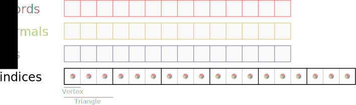
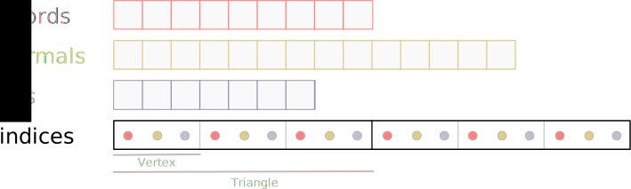

# Mesh generation

While not directly part of the collision detection problem, mesh generation is
useful to extend the range of shapes supported by **ncollide** by discretizing
them such that they can be approximated with a `TriMesh`, a `Polyline`, a
`ConvexHull`, and/or a `Compound`. It is also useful to obtain a
renderer-compliant representation of non-polyhedral models such that balls,
capsules, parametric surfaces, etc. The two main types of mesh generators
output are `TriMesh` and `Polyline`.

### Triangle mesh
The `TriMesh` structure describes a triangle mesh with optional per-vertex
normals and texture coordinates:


| Field     | Description                          |
|--         | --                                   |
| `coords`  | The vertex coordinates.              |
| `normals` | The vertex normals.                  |
| `uvs`     | The vertex texture coordinates.      |
| `indices` | The triangles vertices index buffer. |

The index buffer may take two forms. In its `UnifiedIndexBuffer` form, the
index of a triangle vertex is the same as the index identifying its normal and
texture coordinates. This implies that the coordinate, normals and texture
coordinate buffers should have the same size. While not very memory-efficient,
this is the required representation for renderers based on, e.g., OpenGL. In
the following figure, each disc corresponds to one index (i.e. one integer) and
each square to one buffer element:



In its `SplitIndexBuffer` form, each triangle vertex as three indices: one
for its position, one for its normal, and one for its texture coordinate. This
    representation is usually topologically more interesting than the unified
    index buffer. In the following figure, each disc corresponds to one index
    that identifies the type of element that shares the same color:



It is possible (but time-consuming) to switch between those two kinds of index
buffers:

| Method                  | Description                     |
|--                       | --                              |
| `.unify_index_buffer()` | Transforms the current `TriMesh` index buffer to a `UnifiedIndexBuffer`. This copies the relevant data in order to make sure that every attributes of a single vertex is accessible using the same index. |
| `.split_index_buffer(heal)` | Transforms the current `TriMesh` index buffer to a `SplitIndexBuffer`. If `heal` is set to `true` it will attempt to recover the original mesh topology, identifying with the same index vertices having the exact same position. |

The simplest way to build a `TriMesh` from most primitive shapes defined by
**ncollide** is to import the `ToTriMesh` trait and call the corresponding
method.

| Method             | Description                                    |
|--                  | --                                             |
| `.to_trimesh(...)` | Creates a polyhedral representation of `self`. |

This method requires a parameter that allows you to control the discretization
process. The exact type of this parameter depends on the type that implements
the trait. For example, a `Ball` requires two integers (one for the number of
subdivisions of each spherical coordinate) to be transformed to a `TriMesh`;
the `Cuboid` however requires a parameter equal to `()` because it does not
need any user-defined information in order to be discretized.

### Polygonal line

The `Polyline` is a much simpler data structure than the `TriMesh`. It does not
have an index nor texture coordinates buffer:

| Field     | Description             |
|--         | --                      |
| `coords`  | The vertex coordinates. |
| `normals` | The vertex normals.     |

Since it does not have an index buffer `coords` is assumed to be a line strip,
and there is no way to let two different vertices share the same normal in
memory. This structure is not very practical to model complex 2D shapes. That
is why it should be changed to a more traditional index-buffer based
representation in future versions of **ncollide**.

The simplest way to build a `Polyline` from most primitive shapes defined by
**ncollide** is to import the `Polyline` trait and call the corresponding
method.

| Method              | Description                                      |
|--                   | --                                               |
| `.to_polyline(...)` | Creates a polylineical representation of `self`. |

This method requires a parameter that allows you to control the discretization
process. The exact type of this parameter depends on the type that implements
the trait. For example, a `Ball` requires one integer (for the number of
subdivisions) to be transformed to a `TriMesh`; the `Cuboid` however requires a
parameter equal to `()` because it does not need any user-defined information
in order to be discretized.

## Paths

Path-based mesh generation exposed by the `procedural::path` module allows you
to create more complex 3D shapes by replicating a pattern along a path. Note
that this feature is still extremely immature and at most incomplete. Use with
care.

<center>

</center>

The path-based mesh generation API is based on two traits. The `CurveSampler`
trait is implemented by a structure that is capable of generating a path, i.e.,
a set of points assumed to form a polyline:


| Method    | Description                         |
| --        | --                                  |
| `.next()` | Returns the next point of the path. |

The returned point may be either a `StartPoint`, an `InnerPoint` or an
`EndPoint`. If `EndOfSample` is returned, then the path generation is assumed
to be completed. There may be several pairs of `StartPoint, InnerPoint` inside
of the same path. This allows patterns like dashed lines.


Together with the path, we need the pattern that will be  replicated at each
point of the path. Such pattern must implement the `StrokePattern` trait.

| Method         | Description                                     |
| --             | --                                              |
| `stroke(path)` | Strokes the `path` using `self` as the pattern. |

The stroke pattern is responsible for the mesh generation itself. It has to
duplicate its pattern at each point of the path, and to link those duplicates
correctly to form a topologically sound `TriMesh`. This allows you to easily
stroke paths with possibly very different shapes and connectivity using the
same pattern.

The following example uses the `PolylinePath` together with the
`PolylinePattern` to stroke the arrowed Bézier curve shown at the beginning of
this section.

<ul class="nav nav-tabs">
  <li class="active"><a id="tab_nav_link" data-toggle="tab" href="#path_3D">3D example</a></li>
  <div class="d3" onclick="window.open('https://raw.githubusercontent.com/sebcrozet/ncollide/master/examples/path3d.rs')"></div>
</ul>

<div class="tab-content" markdown="1">
  <div id="path_3D" class="tab-pane in active">
```rust
let control_points = [
    Point3::new(0.0f32, 1.0, 0.0),
    Point3::new(2.0f32, 4.0, 2.0),
    Point3::new(2.0f32, 1.0, 4.0),
    Point3::new(4.0f32, 4.0, 6.0),
    Point3::new(2.0f32, 1.0, 8.0),
    Point3::new(2.0f32, 4.0, 10.0),
    Point3::new(0.0f32, 1.0, 12.0),
    Point3::new(-2.0f32, 4.0, 10.0),
    Point3::new(-2.0f32, 1.0, 8.0),
    Point3::new(-4.0f32, 4.0, 6.0),
    Point3::new(-2.0f32, 1.0, 4.0),
    Point3::new(-2.0f32, 4.0, 2.0),
];

// Setup the path.
let bezier   = procedural::bezier_curve(control_points, 100);
let mut path = PolylinePath::new(&bezier);

// Setup the pattern.
let start_cap   = ArrowheadCap::new(1.5f32, 2.0, 0.0);
let end_cap     = ArrowheadCap::new(2.0f32, 2.0, 0.5);
let pattern     = procedural::unit_circle(100);
let mut pattern = PolylinePattern::new(&pattern, true, start_cap, end_cap);

// Stroke!
let _ = pattern.stroke(&mut path);
```
  </div>
</div>

# Mesh transformation

Meshes can be computed from other meshes as well. This may be useful to make
them usable by some geometric queries that have specific requirements. For
example most queries on **ncollide** require the objects to be convex or to be
the union of several convex objects. A convex hull or a convex decomposition
may thus help to pre-process complex concave meshes.

## Convex Hull

Besides the `ToTriMesh` and `ToLinestrip` traits, the `procedural` and
`transformation` modules export free functions that generate various meshes and
line strips, including those accessible by the two former traits.

It also exposes functions to compute the convex hull of a set of point using
the [QuickHull algorithm](http://en.wikipedia.org/wiki/QuickHull) which has an
average $O(n \log{n})$ time complexity. It is currently not implemented
generically enough to handle any dimension. Therefore only individual functions
exist for the 2D and 3D cases:

| Function            | Description                                     |
| --                  | --                                              |
| `convex_hull2(...)` | Computes the convex hull of a set of 2D points. |
| `convex_hull3(...)` | Computes the convex hull of a set of 3D points. |

If you are not interested in the `Polyline` representation of the 2D convex
hull but only on the original indices of the vertices it contains, use the
`_idx` variant of the function − namely `convex_hull2d_idx(...)`.
The following example creates 100,000 random points and compute their
convex hull.

<ul class="nav nav-tabs">
  <li class="active"><a id="tab_nav_link" data-toggle="tab" href="#convex_hull_2D">2D example</a></li>
  <li><a id="tab_nav_link" data-toggle="tab" href="#convex_hull_3D">3D example</a></li>
  <div class="d3" onclick="window.open('https://raw.githubusercontent.com/sebcrozet/ncollide/master/examples/convex_hull3d.rs')"></div>
  <div class="sp"></div>
  <div class="d2" onclick="window.open('https://raw.githubusercontent.com/sebcrozet/ncollide/master/examples/convex_hull2d.rs')"></div>
</ul>

<div class="tab-content" markdown="1">
  <div id="convex_hull_2D" class="tab-pane in active">
```rust
let mut points = Vec::new();
for _ in range(0u, 100000) {
    points.push(rand::random::<Point2<f32>>() * 2.0f32);
}

let convex_hull = transformation::convex_hull2(&points[..]);
```
  </div>
  <div id="convex_hull_3D" class="tab-pane">
```rust
let mut points = Vec::new();
for _ in range(0u, 100000) {
    points.push(rand::random::<Point3<f32>>() * 2.0f32);
}

let convex_hull = transformation::convex_hull3(&points[..]);
```
  </div>
</div>

<center>

</center>


## Convex decomposition

While [convex](../geometric_representations/simple_shapes.html#convex) objects
have nice properties that help designing efficient algorithms, studies show
that using only convex objects leads to very boring applications! That is why
**ncollide** allows the description of concave objects from its convex parts
using the `Compound` shape. For example, one could describe the following
object as the union of two convex parts:

<center>

</center>

But decomposing manually a concave polyhedra into its convex parts is a very
tedious task and computing an exact convex decomposition is often not
necessary. That is why **ncollide** implements the 3D
[HACD](http://kmamou.blogspot.fr/2011/10/hacd-hierarchical-approximate-convex.html)
algorithm that computes an **approximate** convex decomposition. It is not yet
implemented in 2D.


### HACD

The HACD is simply a clustering algorithm based on a concavity criterion to
separate the different groups. It will group triangles together until the
directional distances between their vertices and their convex hull do not
exceed an user-defined limit.

To compute the decomposition of a triangle mesh, use the `procedural::hacd`
function. It takes three arguments:

| Argument         | Description |
| --               | --          |
| `mesh`           | The `TriMesh` to decompose. It must have normals. Disconnected components of the mesh will not be merged together. |
| `error`          | The maximum _normalized concavity_ per cluster. It must **not** be close to a limit value like `Bounded::max_value()`. Values around 0.03 seems to give fine results for most objects. |
| `min_components` | Force the algorithm not to generate more than `min_components` convex parts. |

Let us define what _normalized concavity_ means. Because there is no official
definition of the concavity of a 3D object, we are using the maximal distance
between the triangle mesh vertices and its convex hull. This distance is
computed along the direction of the vertex normal (hence, it is usually
different from the intuitive distance obtained by orthogonal projection of the
point on the closest convex hull face):

<center>

</center>

Then, to make this concavity measure kind of independent from the whole shape
dimensions, it is divided by the object AABB diagonal $D$:

<center>

</center>

We call the ratio $\frac{d}{D}$ the _normalized concavity_. In this example,
it is equal to $\frac{6.0}{10.0} = 0.6$.


The `procedural::hacd` function returns a tuple. Its first member is the set of
convex objects that approximate the input mesh and the second one is the set of
indices of the triangles used to compute each convex object.


The following figure shows a tube (left), the result of the clustering done by
the HACD algorithm (middle), and the resulting approximate convex decomposition
(right):


The following example creates a concave object using a
[path-based](#paths) mesh generation and approximates it
using the HACD algorithm. Together with
[kiss3d](http://github.com/sebcrozet/kiss3d), this code was used to generate
the figure above.

<ul class="nav nav-tabs">
  <li class="active"><a id="tab_nav_link" data-toggle="tab" href="#hacd_3D">3D example</a></li>
  <div class="d3" onclick="window.open('https://raw.githubusercontent.com/sebcrozet/ncollide/master/examples/hacd3d.rs')"></div>
</ul>

<div class="tab-content" markdown="1">
  <div id="hacd_3D" class="tab-pane in active">
```rust
let control_points = [
    Point3::new(0.0f32, 1.0, 0.0),
    Point3::new(2.0, 4.0, 2.0),
    Point3::new(2.0, 1.0, 4.0),
    Point3::new(4.0, 4.0, 6.0),
    Point3::new(2.0, 1.0, 8.0),
    Point3::new(2.0, 4.0, 10.0),
    Point3::new(0.0, 1.0, 12.0),
    Point3::new(-2.0, 4.0, 10.0),
    Point3::new(-2.0, 1.0, 8.0),
    Point3::new(-4.0, 4.0, 6.0),
    Point3::new(-2.0, 1.0, 4.0),
    Point3::new(-2.0, 4.0, 2.0),
];

let bezier      = procedural::bezier_curve(&control_points, 100);
let mut path    = PolylinePath::new(&bezier);
let pattern     = procedural::unit_circle(100);
let mut pattern = PolylinePattern::new(&pattern, true, NoCap::new(), NoCap::new());
let mut trimesh = pattern.stroke(&mut path);

// The path stroke does not generate normals =(
// Compute them as they are needed by the HACD.
trimesh.recompute_normals();

/*
 * Decomposition of the mesh.
 */
let (decomp, partitioning) = transformation::hacd(trimesh.clone(), 0.03, 0);

// We end up with 7 convex parts.
assert!(decomp.len() == 7);
assert!(partitioning.len() == 7);
```
</div>
