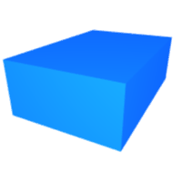

# Simple shapes

Those are the most basic geometric primitives supported by **ncollide**. They
are defined on the `shape` module. A geometric primitive does not have a
position in space. Instead, they are always positioned relative to some
absolute frame. Thus, one usually has to store a transformation matrix
separately from the shape itself.

## Ball
Mathematically speaking, the `Ball` structure describes a closed ball on the
_n_-dimensional euclidean space. In two dimensions this is a disk, and in three
dimensions a sphere, centered at the origin.


| Method | Description |
| --          | --       |
| `.radius()` | The radius of the ball. |

###### Example <span class="btn-primary" onclick="window.open('https://raw.githubusercontent.com/sebcrozet/ncollide/master/examples/ball.rs')"></span>

```rust
let ball = Ball::new(1.0f32);
assert!(ball.radius() == 1.0);
```

<center>


</center>


## Cuboid
The `Cuboid` structure describes a rectangle in two dimensions, or a cuboid in
three dimensions. A cuboid is defined by its _half extents_ − that is − its
half length along each coordinate axis.

| Method | Description |
| --          | --       |
| `.half_extents()` | The half extents of the cuboid. |

###### 2D example <span class="d2" onclick="window.open('https://raw.githubusercontent.com/sebcrozet/ncollide/master/examples/cuboid2d.rs')"></span>

```rust
let cuboid = Cuboid::new(Vec2::new(2.0f32, 1.0));

assert!(cuboid.half_extents().x == 2.0);
assert!(cuboid.half_extents().y == 1.0);
```

###### 3D example <span class="d3" onclick="window.open('https://raw.githubusercontent.com/sebcrozet/ncollide/master/examples/cuboid3d.rs')"></span>

```rust
let cuboid = Cuboid::new(Vec3::new(2.0f32, 1.0, 3.0));

assert!(cuboid.half_extents().x == 2.0);
assert!(cuboid.half_extents().y == 1.0);
assert!(cuboid.half_extents().z == 3.0);
```

<center>


</center>


## Cylinder
The `Cylinder` structure describes a rectangle in two dimensions (use `Cuboid`
instead), or a cylinder in three dimensions. Its principal axis is the
positive $$\bf y$$ axis.


| Method | Description |
| --       | --       |
| `.half_height()` | The half height of the cylinder. |
| `.radius()` | The radius of the cylinder basis. |

###### Example<span class="btn-primary" onclick="window.open('https://raw.githubusercontent.com/sebcrozet/ncollide/master/examples/cylinder.rs')"></span>
```rust
let cylinder = Cylinder::new(0.5f32, 1.0);

assert!(cylinder.half_height() == 0.5);
assert!(cylinder.radius() == 1.0);
```

<center>

</center>


## Cone
The `Cone` structure describes an isosceles triangle in two dimensions, or a
cone of revolution in tree dimensions. A cone is defined by the _radius_ of its
basis and its _half height_ − the half distance between the basis and the apex.
Its principal axis is the positive $$\bf y$$ axis.

| Method | Description |
| --          | --       |
| `.half_height()` | The half height of the cone. |
| `.radius()` | The radius of the cone basis. |

###### Example<span class="btn-primary" onclick="window.open('https://raw.githubusercontent.com/sebcrozet/ncollide/master/examples/cone.rs')"></span>

```rust
let cone = Cone::new(0.5f32, 0.75);

assert!(cone.half_height() == 0.5);
assert!(cone.radius() == 0.75);
```

<center>

</center>

## Capsule
The `Capsule` structure describes the Minkowski sum of a segment and a ball. In
other words, this is a cylinder with its flat extremities replaced by balls. A
capsule is defined by its _half height_ and the _radius_ of its extremities.
Its principal axis is the positive $$\bf y$$ axis.

| Method | Description |
| --          | --       |
| `.half_height()` | The half height of the capsule. |
| `.radius()` | The radius of the capsule extremities. |

###### Example <span class="btn-primary" onclick="window.open('https://raw.githubusercontent.com/sebcrozet/ncollide/master/examples/capsule.rs')"></span>
```rust
let capsule = Capsule::new(0.5f32, 0.75);

assert!(capsule.half_height() == 0.5);
assert!(capsule.radius() == 0.75);
```

<center>
 

</center>

## Convex
The `Convex` structure describes a convex polyhedra. Remember that an object
is said to be convex if it is not self-crossing, and if it contains any segment
joining two of its points:

<center>

</center>

The `Convex` shape is created from a set of points. Note that it does not
compute explicitely the convex hull of the points. Therefore, its creation
takes a constant time.

| Method | Description  |
| --        | --           |
| `.points()`  | The points used to create the `Convex` shape. |

###### 2D example<span class="d2" onclick="window.open('https://raw.githubusercontent.com/sebcrozet/ncollide/master/examples/convex2d.rs')"></span>
```rust
let points = vec![
    Pnt2::new(-1.0f32, 1.0), Pnt2::new(-0.5, -0.5),
    Pnt2::new(0.0, 0.5),     Pnt2::new(0.5, -0.5),
    Pnt2::new(1.0, 1.0)
];

let convex = Convex::new(points);

// Convex does not compute explicitely the convex hull (which has 4 vertices)!
assert!(convex.points().len() == 5);
```
<center>

</center>

###### 3D example<span class="d3" onclick="window.open('https://raw.githubusercontent.com/sebcrozet/ncollide/master/examples/convex3d.rs')"></span>
```rust
let points = vec![
    Pnt3::new(0.0f32, 0.0, 1.0),
    Pnt3::new(0.0, 0.0, -1.0),
    Pnt3::new(0.0, 1.0, 0.0),
    Pnt3::new(0.0, -1.0, 0.0),
    Pnt3::new(1.0, 0.0, 0.0),
    Pnt3::new(-1.0, 0.0, 0.0),
    Pnt3::new(0.0, 0.0, 0.0)
];

let convex = Convex::new(points);

// Convex does not compute explicitely the convex hull (which has 6 vertices)!
assert!(convex.points().len() == 7);
```
<center>

</center>

## Plane
The `Plane` structure describes a solid closed half-space. A plane is defined
by its _normal_. Every point that has a negative or zero dot product with the
plane normal is considered _inside_ of the plane. Other points are considered
_outside_ of the plane.

| Method   | Description  |
| --          | --        |
| `.normal()` | The normal of the plane. |

###### 2D example<span class="d2" onclick="window.open('https://raw.githubusercontent.com/sebcrozet/ncollide/master/examples/plane2d.rs')"></span>
```rust
let plane = Plane::new(Vec2::new(0.0f32, 1.0));

assert!(plane.normal().x == 0.0);
assert!(plane.normal().y == 1.0);
```

###### 3D example<span class="d3" onclick="window.open('https://raw.githubusercontent.com/sebcrozet/ncollide/master/examples/plane3d.rs')"></span>
```rust
let plane = Plane::new(Vec3::new(0.0f32, 1.0, 0.0));

assert!(plane.normal().x == 0.0);
assert!(plane.normal().y == 1.0);
assert!(plane.normal().z == 0.0);
```

## Mesh
The `Mesh` structure describes a polyline in two dimensions, or a triangle mesh
in three dimensions. A mesh is defined by an array of vertices and an array of
indices. Each segment (resp. triangle) in 2d (resp. 3d) is identified by two
(resp. three) indices. It is also possible to provide one normal and one
texture coordinate per vertex. Those are not used for the contact determination
but are useful for ray-casting. Internally, collision detection is accelerated
using an AABB tree.

| Method | Description |
| --          | --       |
| `.vertices()` | The vertex buffer. |
| `.indices()` | The index  buffer.  |
| `.normals()` | The normal buffer. |
| `.uvs()` | The texture coordinates buffer. |
| `.bounding_volumes()` | The bounding volume of each primitive (segment or triangle). |
| `.bvt()` | The space-partitioning acceleration structure used by the mesh. |

Note that to create a `Mesh`, it is necessary to give its type explicitely with
one of the type aliases `shape::Mesh2` or `shape::Mesh3`. Otherwise, you will
have compilation errors.

###### 2D example<span class="d2" onclick="window.open('https://raw.githubusercontent.com/sebcrozet/ncollide/master/examples/mesh2d.rs')"></span>

```rust
let points = vec!(
    Pnt2::new(0.0, 1.0),  Pnt2::new(-1.0, -1.0),
    Pnt2::new(0.0, -0.5), Pnt2::new(1.0, -1.0));

let indices = vec!(Pnt2::new(0usize, 1),
                   Pnt2::new(1,  2),
                   Pnt2::new(2,  3),
                   Pnt2::new(3,  1));

// Build the mesh.
let mesh = Polyline::new(Arc::new(points), Arc::new(indices), None, None);

assert!(mesh.vertices().len() == 4);
```

<center>

</center>


###### 3D example<span class="d3" onclick="window.open('https://raw.githubusercontent.com/sebcrozet/ncollide/master/examples/mesh3d.rs')"></span>

```rust
let points = vec!(
    Pnt3::new(0.0, 1.0, 0.0), Pnt3::new(-1.0, -0.5, 0.0),
    Pnt3::new(0.0, -0.5, -1.0), Pnt3::new(1.0, -0.5, 0.0));

let indices = vec!(Pnt3::new(0usize, 1, 2),
                   Pnt3::new(0,  2, 3),
                   Pnt3::new(0,  3, 1));

// Build the mesh.
let mesh = TriMesh::new(Arc::new(points), Arc::new(indices), None, None);

assert!(mesh.vertices().len() == 4);
```

<center>

</center>
